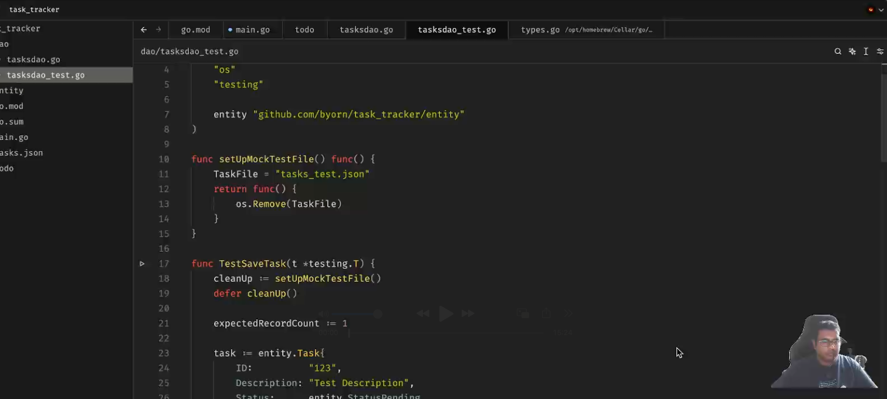

Task Tracker CLI
==

Building this Golang CLI is fairly straight-forward and simple. 
It was created with the intention to build muscle memory in golang syntax, and VIM motions. 
[](https://www.youtube.com/watch?v=<VIDEO_ID>)
https://youtu.be/-euYJJRd2jM
Although I must admit I did get some insights from AI, I did not copy code from AI !!!
The purpose of this exercise was purely to build muscle memory in syntax and vim motions.


A simple, lightweight command-line interface (CLI) tool for managing tasks. Built with Go, this tool helps you organize, track, and complete your tasks efficiently.

## Features

- **Add Tasks**: Create tasks with unique IDs, descriptions, and deadlines.
- **Complete Tasks**: Mark tasks as completed.
- **Delete Tasks**: Remove tasks by their ID.
- **List Tasks**: View all tasks, including their status.
- **Find Tasks**: Search for tasks by their ID.
- **Persistent Storage**: Tasks are stored in a JSON file and loaded into memory for quick access.

---

## Installation

1. Clone the repository:
   ```bash
   git clone https://github.com/byorn/task-tracker.git
   

2. Build the Project
   ```bash
    go build -o tasktracker

3. Run
   ```bash
   ./tasktracker add "Write readmeFile"
   ./tasktracker list 
   ./tasktracker delete '234242324sadfasfasdf'
   ./tasktracker complete '234423#sdfa2343233'
     
